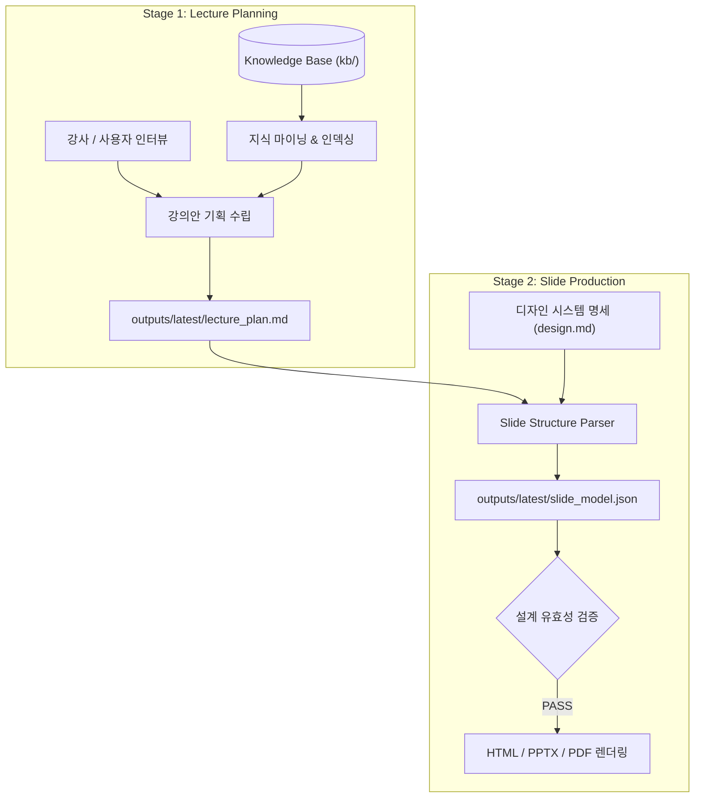

# Lectura

> **AI-Powered Knowledge Mining & Presentation Engineering System**  
> 발표자, 교육자, 지식 생산자를 위한 지식 자산 마이닝 및 멀티채널 슬라이드 엔지니어링 시스템

---

## 📌 개요 (Overview)

**Lectura**는 파편화된 교육 자료와 강의 원천 자산을 체계적인 지식 조각(Atomic Knowledge)으로 분해·구조화하고, 이를 바탕으로 완성도 높은 강의안 기획 및 프로덕션 레벨의 발표용 슬라이드(HTML, PPT, PDF)를 자동 생성하는 AI 협업 엔지니어링 플랫폼입니다.

---

## 🎯 핵심 3원칙 (Core Principles)

Lectura는 콘텐츠의 신뢰성과 디자인의 일관성을 보장하기 위해 명확한 역할 분리 원칙을 준수합니다.

```
┌─────────────────────────────────────────────────────────────┐
│  1. Scenario Plan (내용의 기준)                              │
│     - 청중과 맥락에 최적화된 강의안 및 지식 구조화           │
├─────────────────────────────────────────────────────────────┤
│  2. design.md (표현의 기준)                                 │
│     - 타이포그래피, 컬러 팔레트, 그리드 등 디자인 토큰      │
├─────────────────────────────────────────────────────────────┤
│  3. Slide Model (공통 원본 / Single Source of Truth)        │
│     - HTML 웹 뷰어 및 PPTX/PDF 생성을 위한 정형화된 JSON    │
└─────────────────────────────────────────────────────────────┘
```

---

## 🔄 2단계 파이프라인 (2-Stage Pipeline)

강의 기획과 시각적 슬라이드 설계를 독립된 단계로 분리하여 환각(Hallucination)을 방지하고 콘텐츠의 품질을 극대화합니다.



1. **STAGE 1 (Lecture Planning)**:
   - `kb/` 지식 자산을 기반으로 대상 청중과 학습 목표에 부합하는 정밀 강의안 작성
   - 결과물: `outputs/latest/lecture_plan.md`
2. **STAGE 2 (Slide Production)**:
   - 확정된 강의안과 디자인 토큰을 결합하여 13대 슬라이드 스키마 기반의 구조체 설계
   - 결과물: `outputs/latest/slide_model.json` 및 최종 발표 산출물

---

## 🗂 지식 베이스 아키텍처 (Knowledge Base)

교육 자산은 재사용성과 탐색 효율을 극대화하기 위해 조각 단위로 적재 및 그래프 인덱싱됩니다.

```
kb/
├── theory/          # 핵심 이론, 원리, 개념 정의
├── practice/        # 실습 예제, 코드 스니펫, 구현 가이드
├── tips/            # 실무 팁, 베스트 프랙티스, 트러블슈팅
├── meta/            # 커리큘럼, 강의 메타데이터
├── index.json       # 전체 자산 메타데이터 경량 인덱스
└── graph.json       # 자산 간 참조 관계를 연결한 지식 그래프
```

---

## 📁 디렉토리 구조 (Directory Structure)

```
Lectura/
├── AGENTS.md                  # 에이전트 행동 규칙 및 시스템 가이드라인
├── README.md                  # 프로젝트 개요 및 사용자 가이드
├── kb/                        # 조각 단위 교육 지식 자산 및 지식 그래프
├── docs/                      # 시스템 정책 및 슬라이드 디자인 세부 명세
│   └── agent-policy/          # 디자인 스펙, 워크플로우 명세 문서
├── scripts/                   # 자동화, 검증 및 지식 빌드 스크립트
│   ├── build_kb_graph.py      # 지식 베이스 그래프 및 인덱스 생성기
│   ├── validate.py            # 지식 베이스 무결성 검증기
│   ├── validate_slide_design.py # 슬라이드 모델 스키마 검증기
│   └── security_scan.py       # 커밋 전 시크릿/API 키 누출 스캐너
├── skills/                    # 세부 작업별 전문 프롬프트 및 에이전트 스킬
├── outputs/                   # 단계별 산출물
│   └── latest/                # 최신 강의안 및 슬라이드 모델 고정본
└── tools/                     # 파이썬 래퍼 및 지식 마이닝 유틸리티
```

---

## 🚀 빠른 시작 (Quick Start)

### 1. 환경 설정 (Prerequisites)

- Python 3.10 이상 권장
- 가상환경 활성화 및 의존성 패키지 설치

```bash
# 가상환경 생성 및 활성화
python3 -m venv .venv
source .venv/bin/activate  # macOS / Linux
# .venv\Scripts\activate   # Windows

# 의존성 설치
pip install -r requirements.txt  # 패키지 명세 존재 시
```

### 2. 환경 변수 설정

API 키 및 인증 정보는 `.env` 파일로 관리하며, 저장소에 커밋되지 않습니다.

```bash
cp .env.example .env
# .env 파일에 필요한 API Key 설정
```

---

## 🛠 주요 CLI 도구 및 검증 파이프라인 (CLI Tools)

### 1. 지식 베이스 인덱스 및 그래프 동기화
새로운 지식 자산(`.md`)을 추가하거나 수정한 후 인덱스와 그래프를 갱신합니다.
```bash
python scripts/build_kb_graph.py
```

### 2. 지식 베이스 무결성 검증
프론트매터 누락, 유효하지 않은 JSON, 비어있는 마크다운 파일 여부를 점검합니다.
```bash
python scripts/validate.py
```

### 3. 슬라이드 디자인 스키마 검증
`slide_model.json`이 13대 슬라이드 표준 규격에 맞게 설계되었는지 검증합니다.
```bash
python scripts/validate_slide_design.py
# 또는 특정 파일 검증 시:
python scripts/validate_slide_design.py outputs/latest/slide_model.json
```

### 4. 시크릿 및 인증 키 보안 사전 스캔
코드 및 문서 내 API Key(`nvapi-`, `sk-`, `AIzaSy` 등) 하드코딩 여부를 검사합니다.
```bash
# 전체 워크스페이스 스캔
python scripts/security_scan.py

# Git Staged 파일만 스캔 (Pre-commit)
python scripts/security_scan.py --staged
```

---

## 🔒 보안 및 품질 원칙 (Security & Quality Standards)

- **Zero Secret Leakage**: API Key 및 인증 토큰은 환경변수로만 관리하며, 커밋 전 자동 스캔을 의무화합니다.
- **Git Hygiene**: `_v2`, `_fix` 등의 임시 사본 생성을 금지하며, 원자적 단위의 커밋과 롤백 메커니즘을 준수합니다.
- **Evidence-Based Validation**: 모든 지식 및 슬라이드 변경사항은 검증 스크립트(`validate.py`, `validate_slide_design.py`) PASS(Errors: 0)를 달성해야 합니다.

---

## 📄 라이선스 (License)
본 프로젝트는 개인 오픈소스 프로젝트로, 누구나 자유롭게 참고·수정 및 활용할 수 있습니다. (MIT License)
